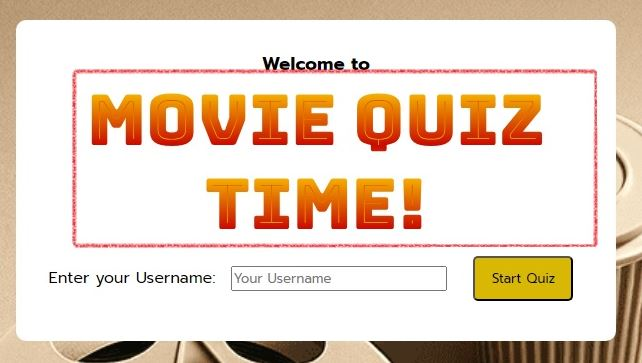

## MOVIE QUIZ TIME!
Welcome to "Movie Quiz Time!", a thrilling and interactive game designed for Hollywood movie aficionados. This game offers an exciting journey through the world of cinema, challenging your knowledge of various film genres, legendary actors, and unforgettable movie moments. From classic cinema masterpieces to modern-day blockbusters, "Movie Quiz Time!" provides a diverse range of trivia questions to test and expand your movie expertise. Whether you're a casual viewer or a seasoned film critic, this game promises to deliver an enjoyable and engaging experience as you explore the rich history of Hollywood cinema.

[Visit live website](https://mabswe.github.io/PP2/)

**Developer: Marat Akbar Boyev**

## Table of Content
  - [Project Goals](#project-goals)
    - [User Goals](#user-goals)
    - [Site Owner Goals](#site-owner-goals)
  - [User Experience](#user-experience)
    - [Target Audience](#target-audience)
    - [User Requirements and Expectations](#user-requirements-and-expectations)
  - [User Stories](#user-stories)
    - [Site User](#site-user)
    - [Site Owner](#site-owner)
  - [Design](#design)
    - [Fonts](#fonts)
    - [Icons](#icons)
    - [Sound Effects](#sound-effects)
    - [Structure](#structure)
  - [Wireframes](#wireframes)
  - [Technologies Used](#technologies-used)
    - [Languages](#languages)
    - [Frameworks, Libraries & Tools](#frameworks-libraries--tools)
  - [Features](#features)
  - [Validation](#validation)
    - [HTML Validation](#html-validation)
    - [CSS Validation](#css-validation)
    - [JavaScript Validation](#javascript-validation)
    - [Accessibility](#accessibility)
    - [Performance](#performance)
  - [Testing](#testing)
    - [Performing tests on various devices](#performing-tests-on-various-devices)
    - [Browser compatibility](#browser-compatibility)
    - [Testing user stories](#testing-user-stories)
  - [Bugs](#bugs)
  - [Deployment](#deployment)
  - [Credits](#credits)
  - [Acknowledgements](#acknowledgements)

## Project Goals
The goal of "Movie Quiz Time!" is to create an engaging and educational experience for movie enthusiasts. It aims to blend fun with learning, offering a platform for users to test their knowledge of Hollywood cinema. The project also focuses on showcasing technical skills in web development, ensuring a seamless and user-friendly interface

### User Goals
- Dive into enjoyable and thrilling game that's simple to comprehend
- Assess the players' depth of knowledge when it comes to movies, putting their expertise and familiarity with cinematic trivia to the test

### Site Owner Goals
- Create an enjoyable, educational movie quiz experience
- Showcase web development skills in responsive design
- Establish an uncomplicated website navigation system
- Ensure the website is completely responsive and accessible to all users

## User Experience
### Target Audience
- For individuals who have an affinity for quizzes
- For those who prefer the simplicity and ease of playing a game
### User Requirements and Expectations
- Enjoyable quiz experience
- Simplicity and user-friendliness
- Engaging movie-related content
- Fun and educational quizzes
- Intuitive and straightforward design
- Responsive website for different screens
- Relevant and interesting movie questions
- Clear and easy-to-use navigation

## User Stories
### Site User
1. I want to test my knowledge and challenge myself with entertaining movie quizzes
2. I expect a user-friendly interface that allows me to easily navigate and enjoy the game
3. I appreciate personalized features like welcome messages that make me feel engaged
4. I want to see the result of the correct answer, whenever I guess the wrong answer
5. I look forward to discovering interesting facts about movies and actors while playing the quiz

### Site Owner:
6. I aim to create an engaging and educational movie quiz experience
7. I want to be able to play the game on desktop, tablet and mobile devices
8. I want to get result of my correct answers so I can know how good my skill is
9. I want to get in touch with the developer
10. I want to add a username so that the game is more engaging and personalized

## Design
### Fonts
Fonts for the website were selected from [Google Fonts](https://fonts.google.com/). The font used for the title, "MOVIE QUIZ TIME!" is 'Bungee Spice', while the text throughout the website is styled with the 'Comfortaa' font

### Icons
Icons for the website were sourced from [Font Awesome](https://fontawesome.com/). The icons used include the LinkedIn icon for linking to the developer's LinkedIn profile, the mail icon for potential email contact or communication and the GitHub icon for linking to the GitHub repository

### Sound Effects
Sound effects have been incorporated into the project to enhance the user experience. These sound effects were selected from [Mix Kit](https://mixkit.co/), and aim to make the quiz more interactive and enjoyable, providing auditory feedback that complements the visual aspects of the game.Two distinct sounds are used:
- Correct Sound: A sound effect is triggered when a user selects the correct answer in the quiz. This sound serves as positive reinforcement and feedback for the player, creating an engaging and rewarding experience
- Wrong Sound: When a user selects an incorrect answer, a different sound effect is played. This helps users immediately recognize their mistake and adds an element of challenge to the quiz

### Structure
The website's structure is designed to provide a seamless and engaging experience for users. It follows a clear hierarchy and organization:
- Welcome Page: Users are greeted with a welcoming and visually appealing page that introduces them to the quiz. They can enter their username and start the quiz from here
- Quiz Interface: The main section of the website is dedicated to the quiz interface. It features the quiz questions, answer options, and navigation buttons, ensuring a straightforward and immersive experience
- Username Display: A personalized touch is added with a display of the user's entered username, creating a sense of connection
- Footer: The footer provides essential information about the developer and includes social media icons for further engagement

## Wireframes

Big screens - laptop & desktop

Medium screens - tablets

Small screens - mobile

## Technologies Used

### Languages
- HTML
- CSS
- JavaScript

### Frameworks, Libraries & Tools
- [Am I Responsive](https://ui.dev/amiresponsive): A responsive web design testing tool to visualize how the website appears on various devices
- [Balsamiq](https://balsamiq.com/): A wireframing tool used for designing the website's layout and structure
- [Favicon.io](https://favicon.io/): A favicon generator to create custom favicons for the website
- [FontAwesome](https://fontawesome.com/): For including icons such as GitHub, LinkedIn, and mail icons
- [GitHub](https://github.com/): A version control platform for code collaboration and hosting the project repository
- [Google Fonts](https://fonts.google.com/): To source and apply custom fonts for typography
- [JSHint](https://jshint.com/): A tool that detects errors and potential problems in JavaScript code
- [Jigsaw W3 Validator](https://jigsaw.w3.org/css-validator/): A CSS validation service by W3C for checking CSS code validity
- [Mixkit](https://mixkit.co/): A resource for sound effects used to enhance the website's interactivity
- [VSCode](https://code.visualstudio.com/): Visual Studio Code, a code editor used for development
- [WC3 Validator](https://validator.w3.org/): The World Wide Web Consortium's Markup Validation Service for checking HTML validity

## Features

### Home Screen
The Website has three pages and are described below
#### Title
- The title prominently displays the game's name, "MOVIE QUIZ TIME!". The popup message is displayed, prompting the user to input their username

See feature

- User stories covered: 3

#### Username Input
- Users are prompted to enter their username.
- The username will be displayed on all the screens thereafter

See feature

- User stories covered: 10

### Game Screen
- When a user selects the correct answer, a visual and auditory effect is triggered, providing feedback and reinforcing their success.Elements displayd on the screen:

See feature

- User stories covered: 1, 2

#### Correct Effect
- If a user selects the correct answer, a visual and auditory effect is triggered, signaling that the answer was correct by changing color to green. Elements displayd on the screen:
    - Title: "MOVIE QUIZ TIME!"
    - Username input field
    - Start quiz button
    - Quiz question
    - Answer options (buttons)
    - Next button
    - Username display
    - Correct answer effect
    - Wrong answer effect
    - Footer information

See feature

- User stories covered: 6

#### Wrong Effect
- If a user selects the wrong answer, a visual and auditory effect is triggered, signaling that the answer was incorrect by changing color to red. Elements displayd on the screen:
    - Username input field
    - Start quiz button
    - Quiz question
    - Answer options (buttons)
    - Next button
    - Username display
    - Correct answer effect
    - Wrong answer effect
    - Footer information
    - Red background highlight
    - Auditory feedback (wrong sound effect)
    - Visual feedback to mark correct selection

See feature

- User stories covered: 4

#### Result Screen
-  Shows the user's score out of the total number of questions answered correctly, providing feedback on their performance in the quiz. Elements displayd on the screen:
    - Final score display
    - Play again button (button)

See feature

- User stories covered: 8

### Footer
- Present across all pages
- Includes a link to the mail, GitHub page, and Linkedin page (open in separate windows)

See feature

- User stories covered: 9