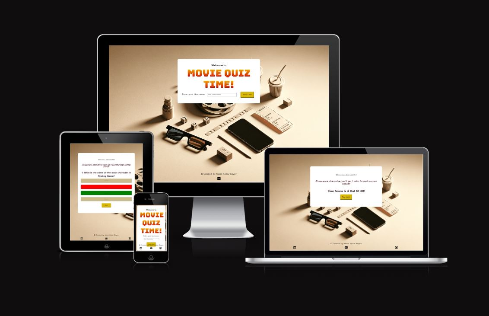

## MOVIE QUIZ TIME!

[Visit live website](https://mabswe.github.io/PP2/)

**Developer: Marat Akbar Boyev**

## Table of Contents
1. [Introduction](#introduction)
2. [Project Goals](#project-goals)
    - [User Goals](#user-goals)
    - [Site Owner Goals](#site-owner-goals)
3. [User Experience](#user-experience)
   - [Target Audience](#target-audience)
   - [User Requirements and Expectations](#user-requirements-and-expectations)
   - [User Stories](#user-stories)
4. [Design](#design)
   - [Fonts](#fonts)
   - [Structure](#structure)
   - [Languages](#languages)
   - [Frameworks, Libraries & Tools](#frameworks-libraries--tools)
5. [Features](#features)
   - [Footer](#footer)
   - [Game Screen](#game-screen)
6. [Validation](#validation)
   - [HTML Validation](#html-validation)
   - [CSS Validation](#css-validation)
   - [JavaScript Validation](#javascript-validation)
7. [Testing](#testing)
   - [Bugs](#bugs)
8. [Deployment](#deployment)
    - [GitHub Pages](#github-pages)
9. [Credits](#credits)
    - [Images](#images)
    - [Code](#code)
10. [Acknowledgements](#acknowledgements)

## Introduction
Welcome to "Movie Quiz Time!", a thrilling and interactive game designed for Hollywood movie aficionados. This game offers an exciting journey through the world of cinema, challenging your knowledge of various film genres, legendary actors, and unforgettable movie moments. From classic cinema masterpieces to modern-day blockbusters, "Movie Quiz Time!" provides a diverse range of trivia questions to test and expand your movie expertise. Whether you're a casual viewer or a seasoned film critic, this game promises to deliver an enjoyable and engaging experience as you explore the rich history of Hollywood cinema.

## Project Goals
The goal of "Movie Quiz Time!" is to create an engaging and educational experience for movie enthusiasts. It aims to blend fun with learning, offering a platform for users to test their knowledge of Hollywood cinema. The project also focuses on showcasing technical skills in web development, ensuring a seamless and user-friendly interface.
### User Goals
Users dive into "Movie Quiz Time!" seeking a thrilling blend of entertainment and movie trivia. It's the perfect digital arena for cinema buffs to challenge their film knowledge and indulge their passion for Hollywood in an exhilarating quiz format.
### Site Owner Goals
The goal is to make "Movie Quiz Time!" a favorite spot for movie fans. We want to offer fun quizzes that are easy to play and bring movie lovers together, all through a website that's enjoyable and simple to use.